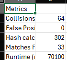
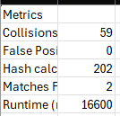
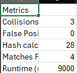

# Rabin-Karp String Search with Metrics

## Description
This project implements the Rabin-Karp search algorithm using a polynomial rolling hash.  
Algorithm also collects metrics and exports it in csv format.

## Features

- Substring search.
- Metrics: Hash calculations, time, false matches, collision.
- CSV export of metrics.
- Tested on short, medium and long strings.

## Project Structure
/src/main/java/hashroll/RabinKarpRollingHash.java - algorithm itself
/src/test/java/hashroll/AppTest.java - tests for algorithm
/src/main/java/hashroll/MetricCollector.java - metrics and export to csv logic

## Metrics
Large graph

Medium graph

Small graph
